# trabalho-infnet-devops

Esta aplicação foi criada como entregável da disciplina de Processos Ágeis e DevOps, da pós-graduação MIT em Engenharia de Software no Instituto INFNET.

Para executar localmente esta API REST, certifique-se que tenha instalado:
- Java 17
- Docker
- IDE de sua preferência

Para executar o Spring Boot, digite no terminal no diretório do projeto:

~~~bash
docker-compose up -d
~~~

e logo após:

~~~bash
./gradlew bootRun
~~~

Para executar os testes:
~~~bash
./gradlew clean test
~~~

Para executar análise estática com spotbugs:
~~~bash
./gradlew clean check
~~~
Foram configurados Prometheus e Grafana para exportação de métricas e criação de dashboards, respectivamente. Para acessar o Grafana,
acesse `http://localhost:3000`.

Segue um exemplo de métricas colhidas a partir da JVM via Micrometer:
---------------------------------------------------
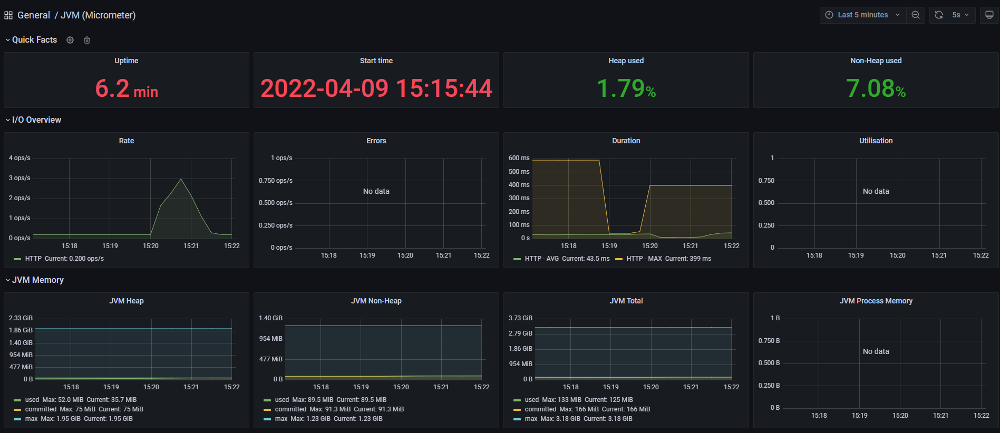
---------------------------------------------------
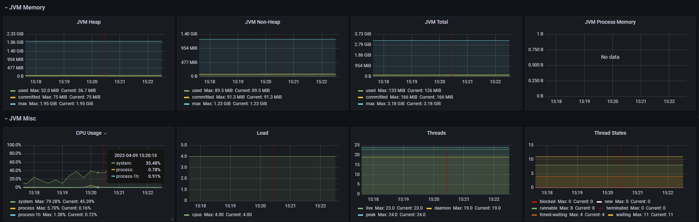
---------------------------------------------------
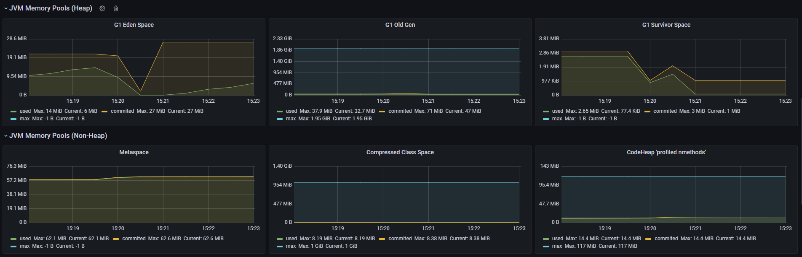

Para acessar o Papertrail, é necessário uma conta privada. Logo, segue um print de tela de execução da mesma.
**Exemplo de exportação dos logs para a ferramenta PaperTrail**:
---------------------------------------------------

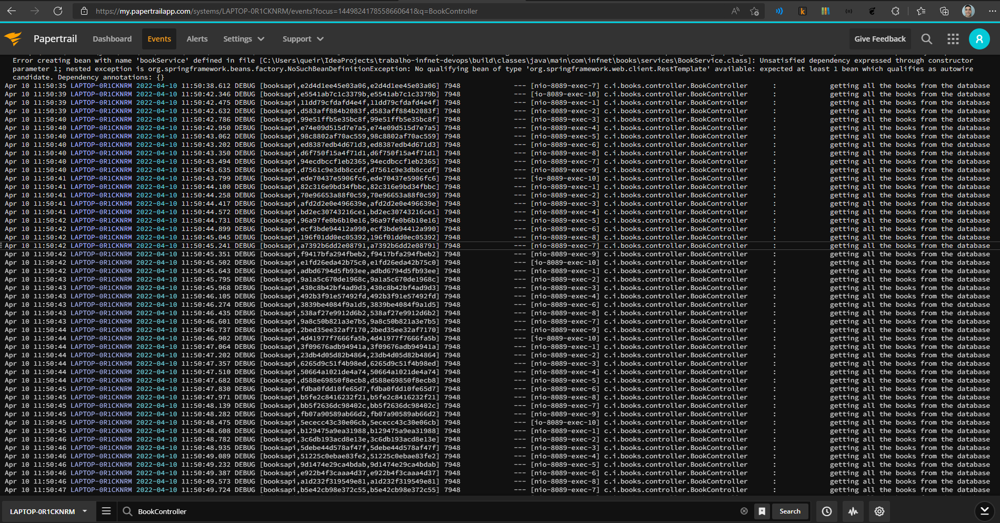

**Exemplo do rastreamento das requisições HTTP na ferramenta Zipkin**. Para acessá-lo, acesse: `http://localhost:9411`.
---------------------------------------------------

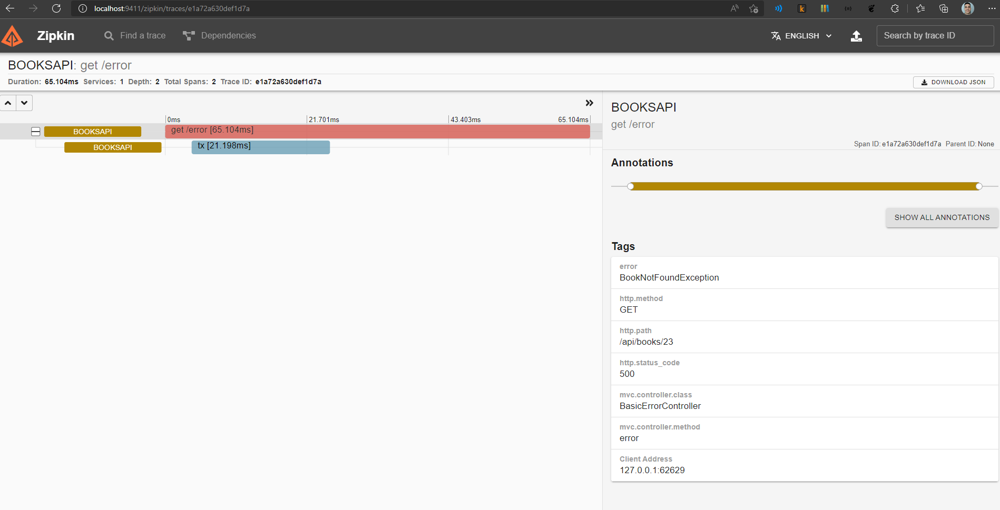
---------------------------------------------------
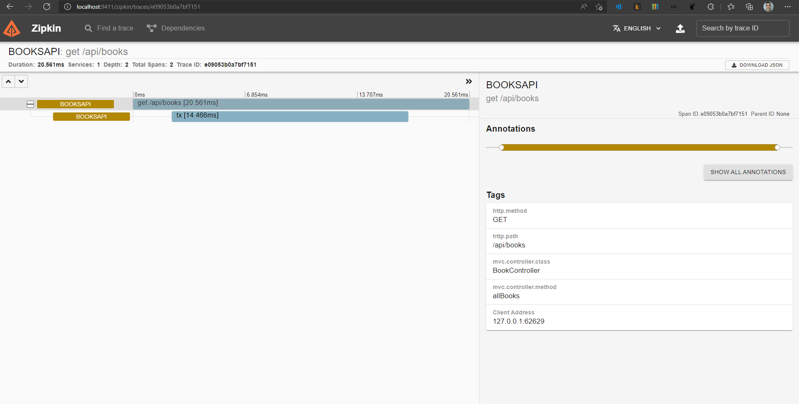
---------------------------------------------------
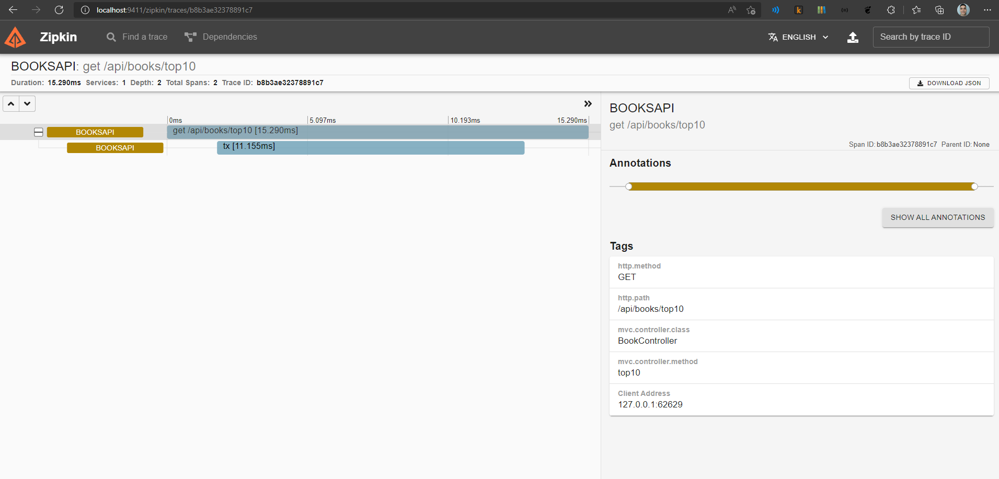
---------------------------------------------------
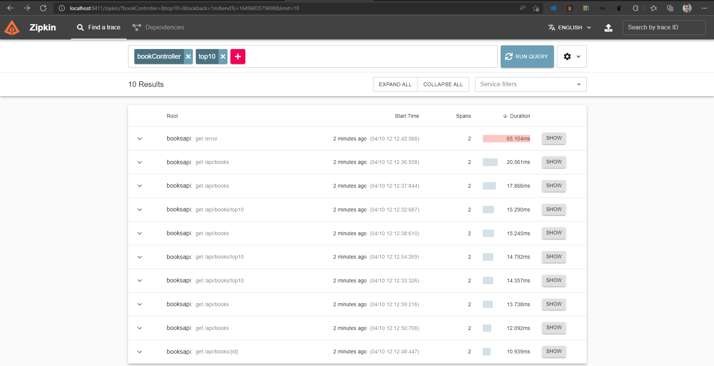
---------------------------------------------------
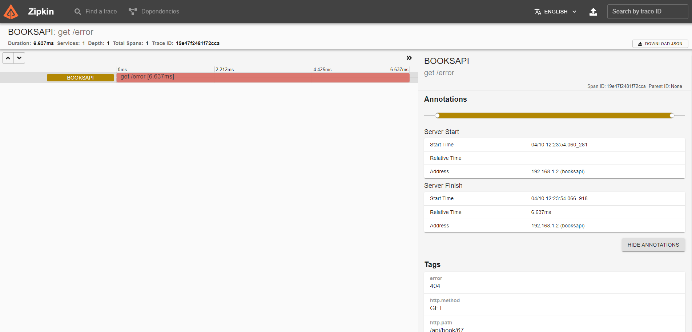

Alguns alarmes criados a partir do Grafana (com alguns erros de conexão com o Prometheus):
---------------------------------------------------

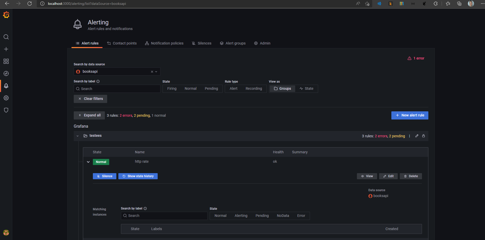
---------------------------------------------------
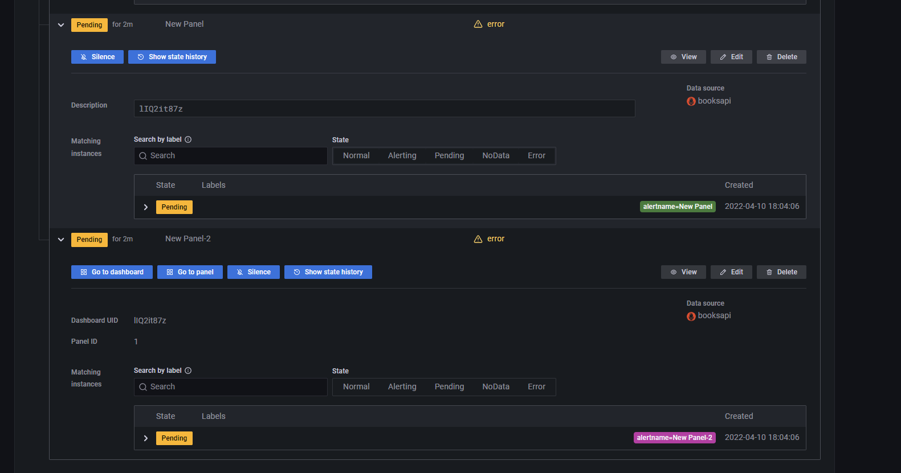

Para propostas de melhoria, basta abrir um Pull Request ou enviar um
email para `alexandrepontesgyn@gmail.com`.

Obrigado!